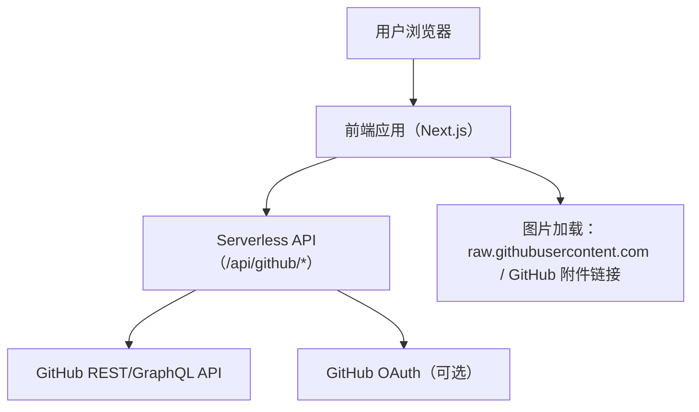
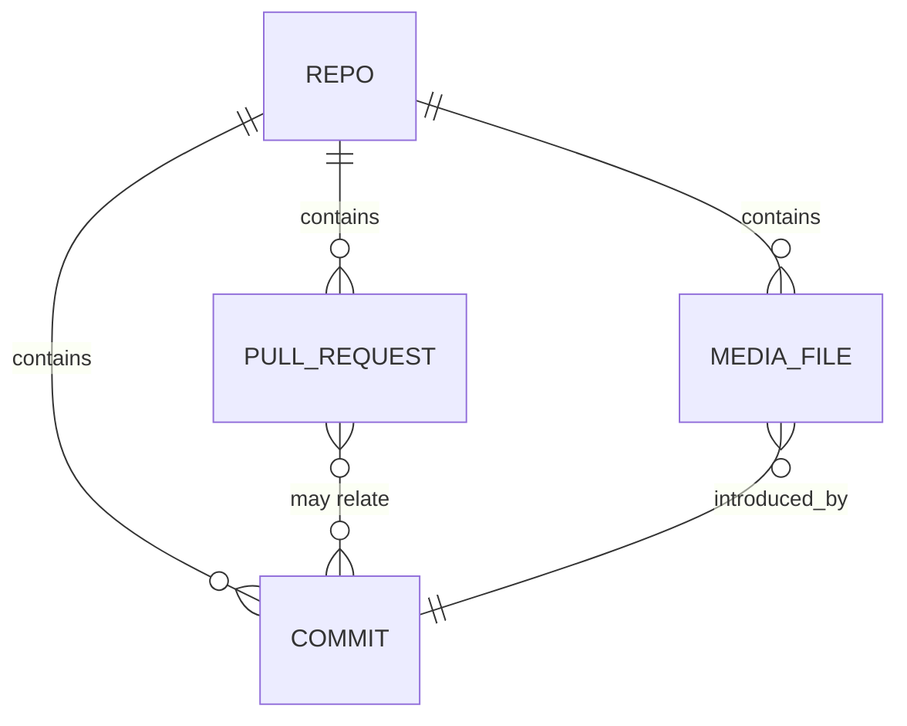

## 1. 架构设计
采用“前端（多页面）+ Serverless API 代理（可缓存）”的方式，满足匿名可用、Token/OAuth 增强，并为 PR/历史/画廊提供统一的数据与图片加载策略。

## 2. 技术选型说明
- 前端：Next.js（React）+ TypeScript
- 样式：CSS Modules 或 Tailwind（实现阶段按工程初始化情况确定）
- 数据获取：前端通过自家 `/api/github/*` 访问 GitHub；匿名/Token/OAuth 由 API 层统一注入 Header
- 缓存策略（不依赖额外第三方服务的最小可行方案）：
  - API 返回 `Cache-Control`（短 TTL）+ `ETag`/`If-None-Match` 透传
  - 前端本地缓存（localStorage/IndexedDB）用于列表页“最近浏览/返回即刻展示”
- 认证存储：
  - Token：仅浏览器本地存储（不落库），请求时由前端发给 API（或写入 HttpOnly Cookie，实施阶段二选一）
  - OAuth：可选增强项，落地时用 HttpOnly Cookie 存 session

## 3. 路由定义
| Route | 用途 |
|-------|------|
| / | 概览 |
| /repo | 仓库选择/收藏（也可合并到设置） |
| /prs | PR 追踪列表 |
| /prs/[number] | PR 详情（时间线/文件变更/图片预览） |
| /history | 提交历史列表 |
| /commit/[sha] | 提交详情 |
| /tree | 文件/目录浏览（可选合并到 /history） |
| /gallery | 图片画廊（目录视角） |
| /stats | 统计看板 |
| /settings | 鉴权与偏好设置 |

## 4. API 定义（Serverless）
约定：全部走服务端代理，避免前端直接打 GitHub API 导致暴露 Token 与 CORS/限流不一致。

### 4.1 通用代理
- GET `/api/github/rest/*path`：代理 GitHub REST（拼接到 `https://api.github.com/*path`）
- POST `/api/github/graphql`：代理 GitHub GraphQL（用于更高效的列表/聚合）

### 4.2 业务聚合（可选，提升前端开发体验）
- GET `/api/repo/summary?owner=&repo=`：仓库摘要（stars/forks/watchers、默认分支、最新提交）
- GET `/api/prs?owner=&repo=&state=&q=&page=`：PR 列表（支持筛选）
- GET `/api/prs/:number?owner=&repo=`：PR 详情（含 timeline 与 files）
- GET `/api/commits?owner=&repo=&path=&author=&page=`：提交列表
- GET `/api/commit/:sha?owner=&repo=`：提交详情
- GET `/api/tree?owner=&repo=&ref=&path=`：目录树（用于画廊与文件浏览）
- GET `/api/gallery/index?owner=&repo=&directory=`：目录下图片索引（过滤常见图片后缀）

## 5. 数据模型（轻量、无数据库）
默认不引入数据库；数据来自 GitHub API。前端本地缓存用于提升体验；服务端只做短 TTL 缓存与条件请求。

