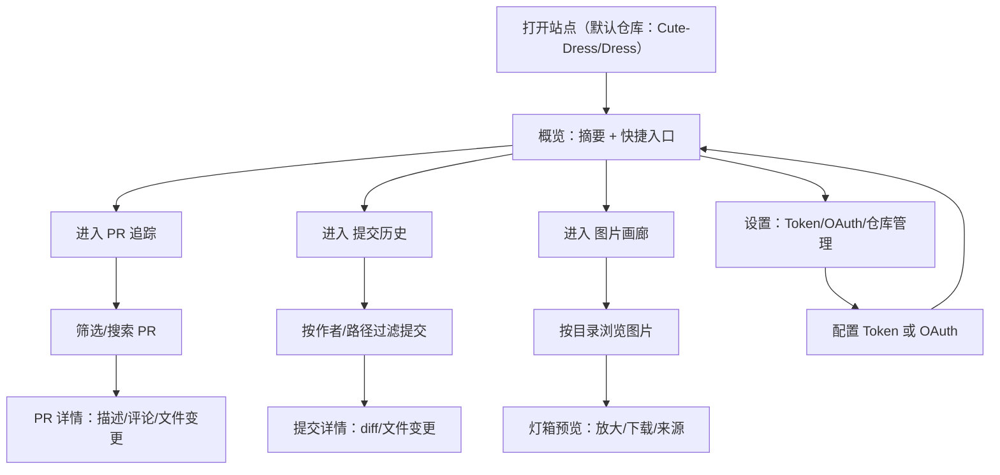

## 1. 产品概述
面向 GitHub 仓库的可视化追踪网页：围绕 Dress（默认仓库）提供 PR、提交历史与图片浏览的“阅读型”体验，并支持切换多个仓库。
- 解决问题：GitHub 原生页面信息密度高但分散；图片/附件阅读体验不统一；对仓库“内容（图片）+ 来源（PR/提交）”缺少一体化视角
- 目标用户：想要快速浏览仓库 PR/历史与图片内容的访客；想提升额度的高级用户（Token/OAuth）

## 2. 核心功能

### 2.1 用户角色
| 角色 | 使用方式 | 核心权限 |
|------|----------|----------|
| 访客 | 匿名访问 | 浏览公开仓库（可能受限流影响） |
| Token 用户 | 在本地填写 GitHub Token | 更高额度、访问更完整字段；Token 仅本地存储 |
| OAuth 用户（可选） | GitHub 登录授权 | 体验最好、额度更高；需要部署回调配置 |

### 2.2 功能模块（页面）
1. **概览（Overview）**：仓库摘要、最近 PR、最近提交、画廊入口、关键趋势
2. **PR 追踪（PR Tracker）**：PR 列表/筛选、PR 详情（时间线/文件变更/评论）、关联提交与文件
3. **提交历史（History）**：提交列表、按作者/路径过滤、查看单个提交详情与文件 diff、单文件历史
4. **图片画廊（Gallery）**：按目录（A–Z/用户目录）浏览图片；支持预览、放大、懒加载；展示来源（来自哪个 PR/提交）
5. **统计看板（Stats）**：PR/提交活跃趋势、贡献者活跃、目录图片分布等
6. **设置（Settings）**：仓库管理（添加/切换/收藏）；鉴权（匿名/Token/OAuth）；缓存与限流提示

### 2.3 页面明细
| 页面名称 | 模块名称 | 功能描述 |
|----------|----------|----------|
| 概览 | 仓库头部卡片 | 仓库头像/封面、stars/forks/watchers、默认分支、简介、快速跳转 |
| 概览 | 快速摘要面板 | 最近合并 PR、最近提交、画廊预览、今日活跃度 |
| PR 追踪 | 列表与筛选 | 状态（open/merged/closed）、作者、标签、关键词、更新时间 |
| PR 追踪 | PR 详情 | 描述渲染（含 Markdown 图片）、时间线（评论/Review）、文件变更（diff） |
| 提交历史 | 提交列表 | 分支、作者、时间、消息；支持路径过滤（目录/文件） |
| 提交历史 | 提交详情 | 文件变更、diff、关联 PR（若能解析到） |
| 提交历史 | 文件/目录浏览 | 目录树、单文件历史（按 commit 回溯） |
| 图片画廊 | 目录导航 | A–Z 与用户目录；面包屑；搜索（按目录/文件名） |
| 图片画廊 | 图片网格 | 懒加载、占位骨架、缩略图；点击进入灯箱预览 |
| 图片画廊 | 灯箱预览 | 缩放、上一张/下一张、下载链接、来源（PR/commit/路径） |
| 统计看板 | 趋势图 | PR/commit 周期趋势、贡献者 Top、目录分布 |
| 设置 | 鉴权 | 匿名/Token/OAuth 入口；Token 本地存储；权限与安全提示 |
| 设置 | 仓库管理 | 添加仓库（owner/repo）、收藏列表、默认 Dress |

## 3. 核心流程
用户主要流程（默认以 Dress 为起点）：
1) 打开站点进入概览 → 2) 选择 PR/历史/画廊 → 3) 深入查看详情（diff/图片/附件） → 4) 需要更高额度时在设置里配置 Token 或 OAuth

## 4. 用户界面设计

### 4.1 设计风格（确定为“最优默认方案”）
方向：Archive Neon（编辑化阅读体验 + 轻霓虹强调），为 Dress 的“内容阅读（图片）+ 来源追溯（PR/commit）”服务。
- 主题：深色底 + 低饱和霓虹点缀（粉/青/金），信息层级清晰、可长时间阅读
- 版式：左侧边栏（功能导航）+ 顶部仓库卡（仓库切换/鉴权入口）+ 主内容（卡片网格/列表）
- 字体：标题使用有性格的衬线（展示感），正文使用清爽无衬线（可读性）
- 动效：以“进入页/切换筛选/打开预览”的整体动作为主，避免过多零碎动效
- 图标：线性图标为主，少量徽标（状态/标签）强调

### 4.2 页面设计概览
| 页面名称 | 模块名称 | UI 元素 |
|----------|----------|---------|
| 概览 | 仓库头部卡片 | 头像/封面、统计 chips、仓库切换、鉴权入口 |
| PR 追踪 | 列表 | 过滤条（chips）、PR 行（状态徽标/作者/更新时间）、快速预览 |
| PR 追踪 | 详情 | 左侧正文（描述/时间线），右侧文件变更/附件预览（可折叠） |
| 提交历史 | 列表与过滤 | 路径过滤输入、作者筛选、提交行（hash/消息/时间） |
| 图片画廊 | 网格与灯箱 | 瀑布/网格、骨架屏、灯箱（缩放/导航/来源） |
| 统计看板 | 图表卡片 | 趋势折线/柱状、Top 列表、目录分布 |
| 设置 | 表单与说明 | Token 输入、OAuth 按钮、仓库收藏列表、安全提示 |

### 4.3 响应式
桌面优先；移动端折叠边栏为抽屉；图片灯箱支持手势（滑动切换/双击缩放）。

